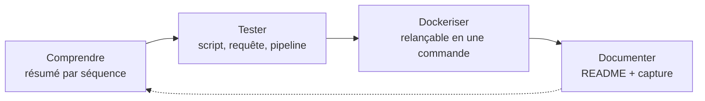
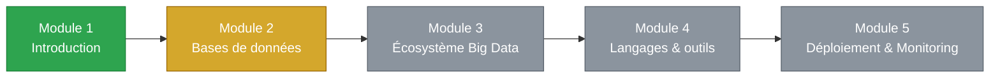

# Data Engineering Certification — Parcours P8

> Dépôt de suivi de ma certification **Data Engineering**, dans le cadre du parcours **Dev Data P8** à **Sonatel Académie / Orange Digital Center (ODC)**, Dakar.
> Certification délivrée via la plateforme **[Force-N](https://formation.force-n.sn/course/view.php?id=3104)** — programme national sénégalais de formation aux métiers du numérique, porté par l'Université Numérique Cheikh Hamidou Kane avec le soutien de la Fondation Mastercard.


---

## Objectif de ce dépôt

Ce repo n'est pas un carnet de cours passif. C'est la trace publique, structurée et exécutable de mon parcours de Data Engineer : chaque module est traité selon la même logique.



Règle simple : pas de module "compris" sans un livrable, pas de livrable sans une commande pour le relancer.

---

## Contexte de la certification

| | |
|---|---|
| Organisme formateur | Sonatel Académie / Orange Digital Center (Dakar) |
| Filière | Dev Data P8 — spécialisation Data Engineering |
| Plateforme de certification | [Force-N](https://formation.force-n.sn/course/view.php?id=3104) |
| Porteur du programme national | Université Numérique Cheikh Hamidou Kane, avec la Fondation Mastercard |

---

## Structure du dépôt

```
data-engineering-certification/
├── README.md
├── LICENSE
│
├── module-1-introduction-data-engineering/    (terminé)
│   ├── README.md
│   ├── notes/resume-module1.md
│   ├── activites/
│   ├── tests/
│   └── ressources/liens.md
│
├── module-2-bases-de-donnees/                 (en cours)
│   ├── README.md
│   ├── notes/
│   ├── projets-pratiques/
│   │   ├── postgresql/
│   │   ├── mongodb/
│   │   ├── neo4j/
│   │   ├── hbase/
│   │   └── redis/
│   ├── activites/
│   ├── tests/
│   └── ressources/
│
├── module-3-ecosysteme-big-data/               (à venir)
│   ├── README.md
│   ├── notes/
│   ├── projets-pratiques/
│   │   ├── hadoop-cluster/
│   │   ├── kafka/
│   │   ├── sqoop/
│   │   └── mapreduce-wordcount/
│   ├── activites/
│   ├── tests/
│   └── ressources/
│
├── module-4-langages-outils/                   (à venir)
│   ├── README.md
│   ├── notes/
│   ├── projets-pratiques/
│   │   ├── python-pandas/
│   │   ├── spark-scala/
│   │   ├── nifi/
│   │   ├── bash-scripting/
│   │   └── dbt/
│   ├── activites/
│   ├── tests/
│   └── ressources/
│
├── module-5-deploiement-monitoring/             (non ouvert)
│
└── assets/
    ├── schemas/
    └── captures/
```

Convention pour chaque outil testé dans `projets-pratiques/` : un `README.md` (ce que ça démontre, comment lancer, résultat observé) accompagné d'un `docker-compose.yml`.

---

## Avancement du parcours



| Module | Thème | Statut | Notes | Pratique |
|---|---|---|---|---|
| 1 | Introduction au Data Engineering | Terminé | [Voir](./module-1-introduction-data-engineering/notes/resume-module1.md) | — (compréhension pure) |
| 2 | Bases de données | En cours | En cours | Postgres, MongoDB, Neo4j, HBase faits · Redis à faire |
| 3 | Écosystème Big Data | À venir | — | Hadoop, Kafka, Sqoop, MapReduce |
| 4 | Langages & outils | À venir | — | Python, Spark, NiFi, dbt |
| 5 | Déploiement & Monitoring | Non ouvert | — | — |

### Détail par module

<details>
<summary><b>Module 1 — Introduction au Data Engineering</b> (terminé)</summary>

**Durée totale :** 6h (2h + 4h)
**Livrables :** [Résumé module 1](./module-1-introduction-data-engineering/notes/resume-module1.md)

#### Séquence 1.1 — Introduction au data engineering (2h)

| Thème | Contenu | Ressource |
|---|---|---|
| 1.1.1 | Définition et origine | [Ryax](https://ryax.tech/fr/quest-ce-que-le-data-engineering/) |
| 1.1.2 | Données structurées / semi / non structurées | Vidéo |
| 1.1.3 | Le Big Data | [LeBigData](https://www.lebigdata.fr/definition-big-data) |
| 1.1.4 | Rôle du data engineer en entreprise | Vidéos |
| 1.1.5 | Missions et compétences clés | [Cartelis](https://www.cartelis.com/blog/data-engineer-definition-missions-competences-salaires-formations/) |
| 1.1.5 | Outils ETL | Talend, Pentaho, SpagoBI |

#### Séquence 1.2 — Découverte de quelques outils Data Engineering (4h)

| Thème | Contenu | Ressource |
|---|---|---|
| 1.2.1 | Les outils d'un data engineer | [Cartelis](https://www.cartelis.com/blog/outils-data-engineers/) |
| 1.2.2 | Stockage et gestion de données | [Hello Pomelo](https://www.hello-pomelo.com/articles/quel-systeme-de-gestion-de-bases-de-donnees-choisir) |
| 1.2.3 | Traitement de données | [AWS Kafka vs Spark](https://aws.amazon.com/fr/compare/the-difference-between-kafka-and-spark/) |
| 1.2.4 | Visualisation et reporting | [DataScientest](https://datascientest.com/power-bi-vs-tableau-vs-qlik) |
| 1.2.5 | Automatisation et déploiement | [Kinsta DevOps](https://kinsta.com/fr/blog/outils-devops/) |

**À retenir :**
- Data Engineering = rendre les données adéquates, accessibles et disponibles pour les consommateurs.
- 5V du Big Data : Volume, Vélocité, Variété, Véracité, Valeur.
- Calcul parallèle = plusieurs serveurs pour augmenter la RAM totale disponible.
- Familles d'outils : stockage, traitement, visualisation, DevOps.

</details>

<details>
<summary><b>Module 2 — Bases de données</b> (en cours)</summary>

**Durée totale :** 14h (2h + 3h + 3h + 4h + 2h)

#### Séquence 2.1 — Introduction aux bases de données (2h)

| Thème | Contenu | Ressource |
|---|---|---|
| 2.1.1 | Définition de la donnée | [École des Données](http://ecoledesdonnees.org/handbook/cours/quest-ce-quune-donnee/index.html) |
| 2.1.2 | Types et formats de données | [OpenClassrooms](https://openclassrooms.com/fr/courses/7527306-decouvrez-le-fonctionnement-des-algorithmes/7759564-decouvrez-les-types-de-donnees-les-plus-frequents) |
| 2.1.3 | Types de stockage de données | — |

#### Séquence 2.2 — Bases de données relationnelles (3h)

| Thème | Contenu | Ressource |
|---|---|---|
| 2.2.1 | Savoir ce qu'est une base de données | [Azure](https://azure.microsoft.com/fr-ca/resources/cloud-computing-dictionary/what-is-a-relational-database) |
| 2.2.2 | Relationnelle et son utilité | [OVHcloud](https://www.ovhcloud.com/fr-sn/learn/what-is-relational-database) |
| 2.2.3 | Modéliser une base relationnelle | [ETS](https://cours.etsmtl.ca/gpa775/Cours/Chapitre%2003%20-%20Mod%C3%A8le%20relationnel.pdf) |
| 2.2.4 | Créer avec PostgreSQL | [GitHub Derek Banas](https://github.com/derekbanas/postgresql-tutorial) |

Pratique : base "vente" testée (clients, produits, commandes), jointures, GROUP BY, vue SQL — voir [`projets-pratiques/postgresql/`](./module-2-bases-de-donnees/projets-pratiques/postgresql/).

#### Séquence 2.3 — Bases de données NoSQL (3h)

| Thème | Contenu | Statut pratique |
|---|---|---|
| 2.3.1 | Types NoSQL (document, graphe, clé-valeur, colonne) | — |
| 2.3.2 | Key-Value Store avec Redis | à faire |
| 2.3.3 | Document stores avec MongoDB | testé |
| 2.3.4 | Graph Store avec Neo4j | testé |
| 2.3.5 | Column store avec HBase | testé |

#### Séquence 2.4 — Bases de données multidimensionnelles (4h)

| Thème | Contenu | Ressource |
|---|---|---|
| 2.4.1 | Fondements des BDD multidimensionnelles | [LIRMM](https://www.lirmm.fr/~laurent/POLYTECH/IG4/DW/poly_bdm.pdf) |
| 2.4.2 | Modélisation conceptuelle | [LAMSADE](https://www.lamsade.dauphine.fr/~negre/fichiers_joints/BI-classique.pdf) (p.44-69) |
| 2.4.3 | Modélisation logique (ROLAP, MOLAP, HOLAP) | LAMSADE (p.70-83) |
| 2.4.4 | Modélisation physique | LAMSADE (p.84-88) |
| 2.4.5 | Mise en œuvre avec SSAS | Tutoriel |

#### Séquence 2.5 — Data Lake (2h)

| Thème | Contenu | Ressource |
|---|---|---|
| 2.5.1 | Présentation des Data Lake | [DataScientest](https://datascientest.com/data-lake-tout-savoir) |
| 2.5.2 | Création avec outils open source | [Emmanuel Bama](https://emmanuelbama.net/2023/03/05/top-5-des-solutions-open-source-pour-deployer-une-infrastructure-de-data-lakehouse/) |

</details>

<details>
<summary><b>Module 3 — Écosystème Big Data</b> (à venir)</summary>

**Livrables prévus :** résumés + cluster Hadoop, Kafka, Sqoop, WordCount MapReduce

#### Séquence 3.1 — Architecture et services Hadoop (3h)

| Thème | Contenu | Ressource |
|---|---|---|
| 3.1.1 | Définition du Big Data | [Theodo](https://data-ai.theodo.com/fr/parlons-data/big-data-histoire-application) |
| 3.1.2 | 5V du Big Data | — |
| 3.1.3 | Composantes et services Hadoop | [YARN](https://www.geeksforgeeks.org/hadoop-yarn-architecture/) · [MapReduce](https://www.simplilearn.com/tutorials/hadoop-tutorial/mapreduce) |

#### Séquence 3.2 — Outils d'ingestion de données

| Thème | Contenu |
|---|---|
| 3.2.1 | Sqoop : composants et utilisation |
| 3.2.2 | Architecture Flume |
| 3.2.3 | Kafka et son architecture |

#### Séquence 3.3 — Types de traitement en Big Data (2h)

| Thème | Contenu | Ressource |
|---|---|---|
| 3.3.1 | Traitement en batch | [AWS Batch](https://aws.amazon.com/fr/what-is/batch-processing/) |
| 3.3.2 | Traitement en streaming | [Confluent](https://www.confluent.io/fr-fr/learn/data-streaming) |

#### Séquence 3.4 — Principe Map-Reduce

| Thème | Contenu | Ressource |
|---|---|---|
| 3.4.1 | Fondements théoriques | [DataScientest](https://datascientest.com/mapreduce) |
| 3.4.2 | Phases du MapReduce | [GeeksforGeeks](https://www.geeksforgeeks.org/mapreduce-understanding-with-real-life-example/) |

</details>

<details>
<summary><b>Module 4 — Langages & outils</b> (à venir)</summary>

**Durée totale :** 42h (7h + 10h + 10h + 5h + 10h)

#### Séquence 4.1 — Python / Pandas (7h)

Installation Anaconda, bases Python, extraction et traitement de données avec Pandas.

#### Séquence 4.2 — Spark / Scala (10h)

Installation (IntelliJ, Scala, Spark), introduction à Spark, traitement batch (RDD/Dataset/DataFrame), Spark Streaming, data quality.

#### Séquence 4.3 — Apache NiFi (10h)

20 thèmes couvrant l'installation, la connexion aux sources (CSV, Excel, JSON, base de données), le traitement, le filtrage, et l'orchestration de flux (Process Groups).

#### Séquence 4.4 — Bash Scripting (5h)

Environnement Linux, bases de Bash, gestion fichiers/utilisateurs/processus, commandes HDFS, shell scripting.

#### Séquence 4.5 — dbt (10h)

Introduction à dbt, dbt Core vs dbt Platform, analytics engineering, configuration, modèles, sources, tests de qualité, documentation, déploiement.

</details>

<details>
<summary><b>Module 5 — Déploiement & Monitoring</b> (non ouvert)</summary>

Contenu pas encore communiqué par Sonatel Académie / Orange Digital Center.

</details>

---

## Stack technique visée

| Catégorie | Outils |
|---|---|
| Langages | Python, SQL, Scala, Bash |
| Bases de données | PostgreSQL, MongoDB, Redis, Neo4j, HBase |
| Big Data | Hadoop (HDFS/YARN), MapReduce, Spark, Kafka, Sqoop, Flume |
| ETL / Orchestration | Apache NiFi, dbt, Airflow (à venir) |
| Data Viz | Power BI, Tableau, Qlik |
| DevOps / Infra | Docker, Docker Compose, Ansible, Kubernetes |

---

## Comment naviguer dans ce repo

- Comprendre un module : lire son `README.md` puis ses `notes/`.
- Voir du concret : `projets-pratiques/`, chaque sous-dossier a son `README.md` avec la commande de lancement.
- Relancer un test : `cd projets-pratiques/{outil} && docker compose up`.
- Retrouver les liens sources : `ressources/liens.md` de chaque module, classés par séquence.

---

## Roadmap personnelle

- [x] Module 1 — Introduction au Data Engineering
- [ ] Module 2 — Bases de données
  - [x] PostgreSQL
  - [x] MongoDB
  - [x] Neo4j
  - [x] HBase
  - [ ] Redis
  - [ ] Data Lake
- [ ] Module 3 — Écosystème Big Data
- [ ] Module 4 — Langages & outils
- [ ] Module 5 — Déploiement & Monitoring
- [ ] Capstone — pipeline Data Engineering complet (ingestion → stockage → transformation → visualisation)

---

## Contact

**Abdou** — Data Engineering, Sonatel Académie / Orange Digital Center, Dakar
GitHub : [@abdoudjigo](https://github.com/abdoudjigo)
Certification : [Force-N](https://formation.force-n.sn/course/view.php?id=3104)