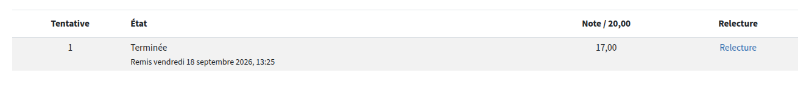
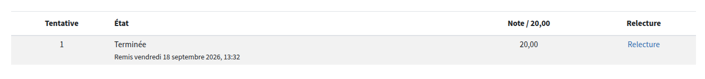
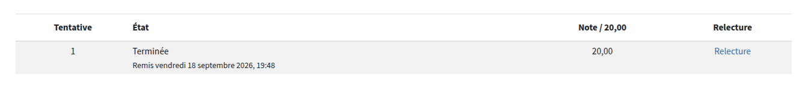

# 🏆 Tests de connaissance — Module 1

Résultats des tests de connaissance officiels de l'école, passés le **vendredi 18 septembre 2026**.

| Test | Séquence / Thème | Note | Capture |
|---|---|---|---|
| Test de connaissance 1.1.1 | Séq. 1.1 — Introduction au data engineering | **17/20** |  |
| Test de connaissance 1.1.2 | Séq. 1.1 — Introduction au data engineering | **20/20** |  |
| Test de connaissance 1.2.1 | Séq. 1.2 — Découverte des outils Data Engineering | **20/20** |  |

## 📊 Bilan

- **Moyenne module 1 : 19/20**
- 2 tests sur 3 réussis à 100%
- Le 17/20 sur le test 1.1.1 concerne les notions d'introduction (définition, 5V) — à revoir si besoin.
