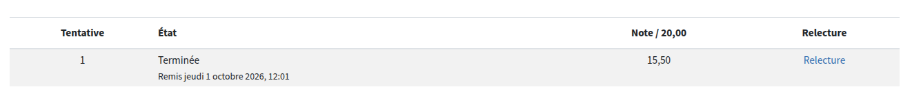

# Tests de connaissance — Module 2

Résultats archivés des tests de connaissance officiels de l'école (score + date).

| Test | Séquence | Note obtenue | Seuil de réussite | Date | Capture |
|---|---|---|---|---|---|
| Test de connaissance Séquence 3 | Séq. 3 — Bases de données NoSQL | **15,50 / 20** | 10,00 / 20 | jeudi 1 octobre 2026 |  |

## Détail

**Test de connaissance Séquence 3** (Bases de données NoSQL)
- Temps disponible : 20 min
- Méthode d'évaluation : note la plus haute (sur plusieurs tentatives autorisées)
- 1 tentative effectuée, note obtenue : 15,50/20 — réussi (seuil : 10/20)